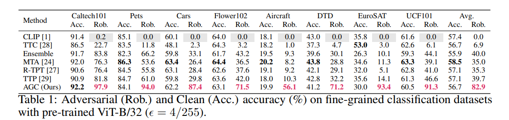

# AGC: Adaptive Geometric Correction for Adversarial Robustness on Vision-Language Models

This repository is the official implementation of AGC: Adaptive Geometric Correction for Adversarial Robustness on Vision-Language Models. 

## Requirements

To install requirements:

python = 3.11
```setup
pip install -r requirements.txt

# clip
$ pip install ftfy regex tqdm
$ pip install git+https://github.com/openai/CLIP.git

# foolbox
$ pip install foolbox

#autoattack
pip install git+https://github.com/fra31/auto-attack.git
```

## Evaluation

To evaluate AGC on specific benchmarks, run:

```test
python test.py --model_name ... --dataset_root ... --datatype ...
```
#### Note:
- **model_name** is the name of pretrained clip model e.g.
'ViT-B/32' 'RN50'...
- **dataset_root** is the path to the dataset e.g. './datasets/caltech-101'
- **datatype** is the type of dataset e.g. 'caltech101' 

To successfully run the above command, please make sure to download the datasets and place them in the specified path following [CoOp](https://github.com/KaiyangZhou/CoOp). The folder structure of the dataset is suggested to be like this:

```
datasets/
├── aircraft/
│   └── images/
├── caltech-101/
│   ├── 101_ObjectCategories/
│   └── Annotations/
├── dtd/
│   ├── images/
│   ├── imdb/
│   └── labels/
├── eurosat/
│   └── 2750/
├── flowers/
│   └── jpg/
├── flowers102/
│   └── jpg/
├── pets/
│   ├── annotations/
│   └── images/
├── stanford_cars/
│   ├── cars_test/
│   ├── cars_train/
│   └── devkit/
└── ucf101/
    └── UCF-101/
```

## Results

Our method achieves the following performance on ViT-B/32 attacked by PGD with epsilon = 4/255:




## License

This project is released under the MIT License.